# Terraform

En este ejercicio usaremos terraform para hacer uns infraestructura backend y frontend, para ello he creado tres archivos con extension tf llamadas:
- frontend.tf
- backend.tf
- variables.tf  
Tanto frontend.tf y backend.tf usan una estructuracion similar, ya que se dividen en "estructuras" que indican el recurso que utilizan, cada recurso tiene un tipo de dato que va a guardar que son:
- crear un grupo de seguridad
- crear un rol de grupo de seguridad
- crear una instancia
- crear una ip
- crear una ip elastica

Para cada recurso se le pone un nombre unico quew los diferencie de otro recuso tanto del mismo archivo y de otros, es decir si a un recurso le llamo "ip_elastica" y en otro recurso de otro archivo que comparte mismo directorio tiene el miosmo nombre terraform se quejará poruqe los nombres son unicos

Para hacer el proyecto más seguro he almacenado la información que terraform necesita para crear las instancias en variables.tf, asique explicaré un recurso y explicaré sus variables.
Por ejemplo en el caso de bacjend.tf he hecho lo siguiente:

Primero decimops que el proovedor es amazon web service y culla region es el norte de virginia
```
provider "aws" {
  region = var.region
}
```
Para llamar a una variable usamos "var.NombreVariable" para que sepa que le estamos pasando una variable del archivo variables.tf, esta variable en el archivo de variables es el siguiente
```
variable "region" {
  description = "Región de AWS donde se creará la instancia"
  type        = string
  default     = "us-east-1"
}
```
Aqui le estamos diciendo que el nombre de la variable es "region" y que: 
- le pasamos una descripcion a la variable con "description"
- le decimos que es de tipo de string en "type"
- le pasamos el valor que guarda la variable en "default" el cual es el norte de virginia
Para crear una variable siempre se usa ese patrón.

Acontinuacion creamos el grupo de seguridad de la instancia 
```
resource "aws_security_group" "sg_backend" {
  name        = var.sg_name_back
  description = var.sg_description_back
}
```
Aquí indicamos cual es el nombre del grupo de seguridad en "name" y cual es su descripcion en "description", las variables usadas aqui son las siguientes
```
variable "sg_name_back" {
  description = "Nombre del grupo de seguridad"
  type        = string
  default     = "sg_backend"
}
```
Aquí indicamos el nombre del grupo de seguridad y en la siguiente variable indicamos la descripcion del grupo de seguridad:
```
variable "sg_description_back" {
  description = "Descripción del grupo de seguridad"
  type        = string
  default     = "Grupo de seguridad para la instancia backend"
}
```
Siguiendo con backend.tf la siguiente instruccion es el rol de grupo de seguriodad que cumple, usamos dos, uno de ingreso y otro de respuestadonde le decimos lo siguiente:
```
resource "aws_security_group_rule" "ingress" {
  security_group_id = aws_security_group.sg_backend.id
  type              = "ingress"

  count       = length(var.allowed_ingress_ports_back)
  from_port   = var.allowed_ingress_ports_back[count.index]
  to_port     = var.allowed_ingress_ports_back[count.index]
  protocol    = "tcp"
  cidr_blocks = ["0.0.0.0/0"]
}
```
Aqui le estamos diciendo que el nombre de la variable que crea el rol de los grupos de seguridad se llama "ingress", que el tipo es de ingreso, ademas en "security_group_id" le deciomos la id del grupo de seguridad que hemos creado anteriormente asignandole "aws_security_group.sg_backend.id", id coje literalmente la id del grupo de seguridad, que el tipo de protocolo es tcp y que está expuesto a todos los puertos, en "count" asta "to_port" pasa lo siguiente, si te fijas ñe estamos pasando variables con un index, y es que en el archivo de variables hemos creado lo siguiente
```
variable "allowed_ingress_ports_back" {
  description = "Puertos de entrada del grupo de seguridad"
  type        = list(number)
  default     = [3386]
}
```
El tipo de variable es una lista cullo valor guarda una lista de datos, entonces podemos comprender que el recurso está recorriendo cada dato de la lista como si de un for se tratara donde:
- count crea multibles instancias segun el numero de elementos de la lista
- ength(var.allowed_ingress_ports_back) es la longitud de la lista
- from_port  va a recorrer desde el primer puerto de la lista
- to_port es el ultimo elemento dfe la lista
- var.allowed_ingress_ports_back[count.index] esd el index actual de la lista, o mejor dico el puerto actual que se encuentra en el index actual de la lista
- En este caso el unico puerto es el 3386

Despues dfe este recurso creamos el siguiente que son las reglas de salida: 
```
resource "aws_security_group_rule" "egress" {
  security_group_id = aws_security_group.sg_backend.id
  type              = "egress"

  from_port   = 0
  to_port     = 0
  protocol    = "-1"
  cidr_blocks = ["0.0.0.0/0"]
}
```
Es casi identico al recurso de las reglas de  entrada solo que en el tipo de rol le asignamos "egress" para indicar que es de salida

El siguiente recurso es la creacion de la maquina virtual, el cual es el siguiente
```
resource "aws_instance" "backend" {
  ami             = var.ami_id_back
  instance_type   = var.instance_type_back
  key_name        = var.key_name_back
  security_groups = [aws_security_group.sg_backend.name]

  tags = {
    Name = var.instance_name_back
  }
}
```
Aqui indicamos que el tipo de recurso es aws_instance y que se llama backend, en el:
- indicamos la ami de la instancia con ami
- decimos el tipo de instancia
- le damos el nombre de la key
- y mostramos cual es el grupo de seguridad que hemos creado en la instancia el cual se indica con [aws_security_group.sg_backend.name] donde sg_backend es literalmente el nombre del recurso del gurupo de seguridad que hemos creado antes, .name coje el nombre
En tag creamos una etiqueta al cual le pasamos el nombre de la instancia

Las variables que hemos creado para este recurso son los siguientes 
```
variable "ami_id_back" {
  description = "Identificador de la AMI"
  type        = string
  default     = "ami-04b4f1a9cf54c11d0"
}
```
Para ponerle el nombre de la ami he hecho lo siguiente:
- He ido a amazon web service, he ido a mis instancias y he pulsado el boton amarillo "lanzar instancias"
- Despues he seleccionado en imagenes de aplicaciones la imagen de ubuntu
- Despues he copiado la ID de AMI
- - Y la he copiado en la variable ami_id_back en el valor por defecto 'default = "ami-04b4f1a9cf54c11d0"'

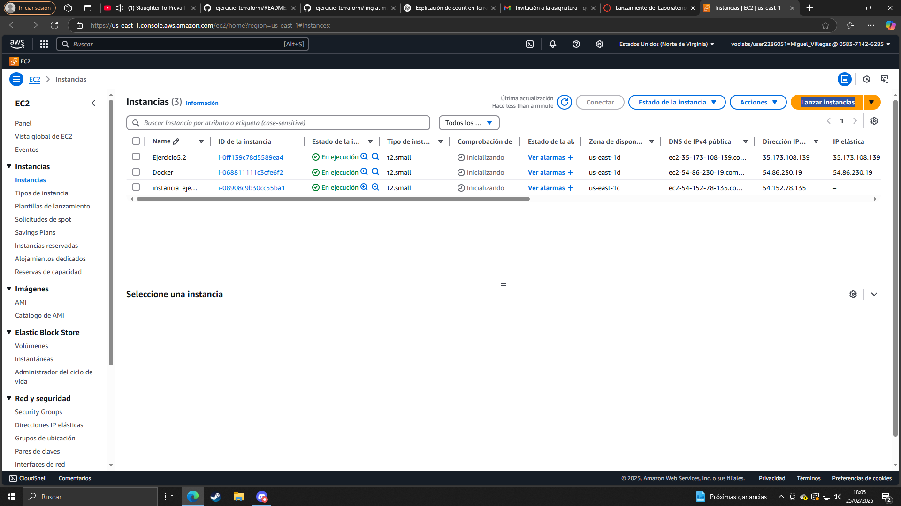
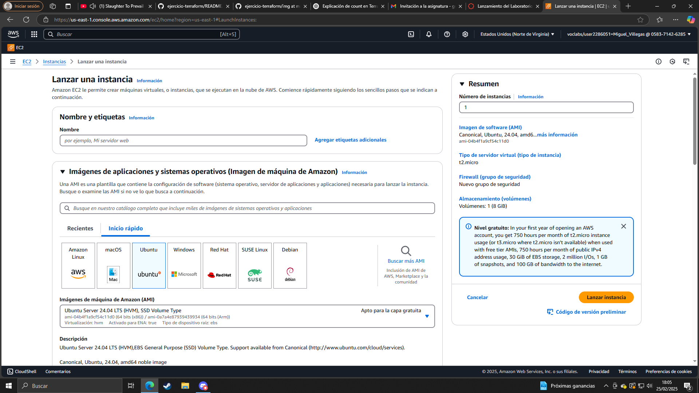
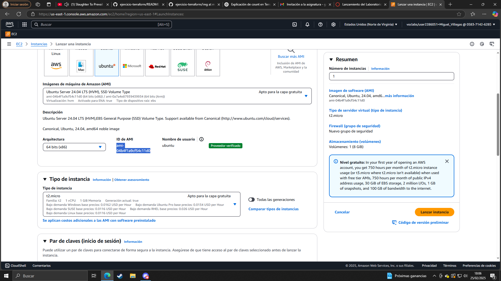

```
variable "instance_type_back" {
  description = "Tipo de instancia"
  type        = string
  default     = "t2.medium"
}
```
Esta variable guarda el tipo de instancia, en este caso vamos a crear uno t2.medium
```
variable "key_name_back" {
  description = "Nombre de la clave pública"
  type        = string
  default     = "vockey"
}
```
Aquí seleccionamos el par de claves de la instancia, en este caso es vockey
```
variable "instance_name_back" {
  description = "Nombre de la instancia"
  type        = string
  default     = "backend"
}
```
Esta variable guarda el nombre de la instancia, en este caso lo vamos a llamar backend

Por ultimo en nuestro archivo backend.tf vamos a crear dos recursos para crear una ip elastica y para asociarlo a nuestra instancia, lo hacemos de la siguiente manera
```
resource "aws_eip" "b" {
  instance = aws_instance.backend.id
}
```
En este recurso creamos la ip elastica indicandole quie la instancia a la que la vamos a asociar es a backend, el .id coge la id de la instancia
# Mostramos la IP pública de la instancia
```
output "elastic_ip" {
  value = aws_eip.b.public_ip
}
```
Por ultimo mostramos la ip publica de la instancia 

con lo cual El archivo backend.tf deberia verse asi
imagenes


El mismo patrón seguimos para el archivofrontend.tf
Primwero configuramos el provedor de amazon web services indicando la region del mismo, aquí de hecho reutilizamos la variable "var.region" usada en el archivo anterior
```
provider "aws" {
  region = var.region
}
```
despues creamos el grupo de seguridad donde indicamos el nombre del grupo de seguridad, su descripcion, etc
```
resource "aws_security_group" "sg_fontend" {
  name        = var.sg_name_front
  description = var.sg_description_front
}
```
culla variables usadas son 
```
variable "sg_name_front" {
  description = "Nombre del grupo de seguridad"
  type        = string
  default     = "sg_fontend"
}
```
para el nombre del grupo de seguridad y para la descripcion usamos la variable siguiente:
```
variable "sg_description_front" {
  description = "Descripción del grupo de seguridad"
  type        = string
  default     = "Grupo de seguridad para la instancia frontend"
}
```
A continuacion creamos el recurso para crear las reglas de entrada de la instancia
```
resource "aws_security_group_rule" "ingreso" {
  security_group_id = aws_security_group.sg_fontend.id
  type              = "ingress"

  count       = length(var.allowed_ingress_ports_front)
  from_port   = var.allowed_ingress_ports_front[count.index]
  to_port     = var.allowed_ingress_ports_front[count.index]
  protocol    = "tcp"
  cidr_blocks = ["0.0.0.0/0"]
}
```
Y culla lista de puertos es 
```
variable "allowed_ingress_ports_front" {
  description = "Puertos de entrada del grupo de seguridad"
  type        = list(number)
  default     = [22, 80, 443]
}
```
Esta vez los puertos de estrada son el 22, 2l 80 y el 443.

Despues creamos las reglas de salida del grupo de seguridad.
```
resource "aws_security_group_rule" "salida" {
  security_group_id = aws_security_group.sg_fontend.id
  type              = "egress"

  from_port   = 0
  to_port     = 0
  protocol    = "-1"
  cidr_blocks = ["0.0.0.0/0"]
}
```
Despues damos a paso a crear la maquina virtual
```
resource "aws_instance" "frontend" {
  ami             = var.ami_id_front
  instance_type   = var.instance_type_front
  key_name        = var.key_name_front
  security_groups = [aws_security_group.sg_fontend.name]

  tags = {
    Name = var.instance_name_front
  }
}
```

Culla variables son 
```
variable "ami_id_front" {
  description = "Identificador de la AMI"
  type        = string
  default     = "ami-00874d747dde814fa"
}
```
Para el nombre de la ami
```
variable "instance_type_front" {
  description = "Tipo de instancia"
  type        = string
  default     = "t2.small"
}
```
Para el tipo de instancia
```
variable "key_name_front" {
  description = "Nombre de la clave pública"
  type        = string
  default     = "vockey"
}
```
Para las llaves
```
variable "instance_name_front" {
  description = "Nombre de la instancia"
  type        = string
  default     = "frontend"
}
```
Por ultimo creamos la ip elastica y la asociamos a la instancia
```
resource "aws_eip" "f" {
  instance = aws_instance.frontend.id
}

output "ip_elastica" {
  value = aws_eip.f.public_ip
}
```
Con lo cual nuestro archivo frontend se debe ver de la siguiente manera

Una vez hecho esto tenemos que hacer un par de ajustes, en nuestra terminal de visual studio code
Primero intalaremos terraform desde su pagina oficial, cullo link es: https://developer.hashicorp.com/terraform/tutorials/aws-get-started/install-cli  

En la seccion "Install Terraform" seleccionamos la opcion linux > amazon linux  

imagen

Instalamos yum-config-manager al repositorio con el comando
```
sudo yum install -y yum-utils
```
Añadimos hasiCorp a nuestro repositorio  
```
sudo yum-config-manager --add-repo https://rpm.releases.hashicorp.com/AmazonLinux/hashicorp.repo
```
Y por ultimo instalamos terraform
```
sudo yum -y install terraform
```

Una vez hecho esto y antes de usar cualquier comando terraform tenemos que cambiar las credenciales de amazom web services, las credenciales siempre cambian cada vez que encendemos el laboratorio de amazon, para cambiar las credenciales haremos lo siguiente:
- nos vamos al lanzamiento del laboratorio y le hacemos click en AWS details
- En AWS CLI le hacemos click a show
Una vez hagamos eso copiamos todo el texto largo que nos aparece, entonces nos vamos a la terminal de visual studio y hacemos lo siguiente:

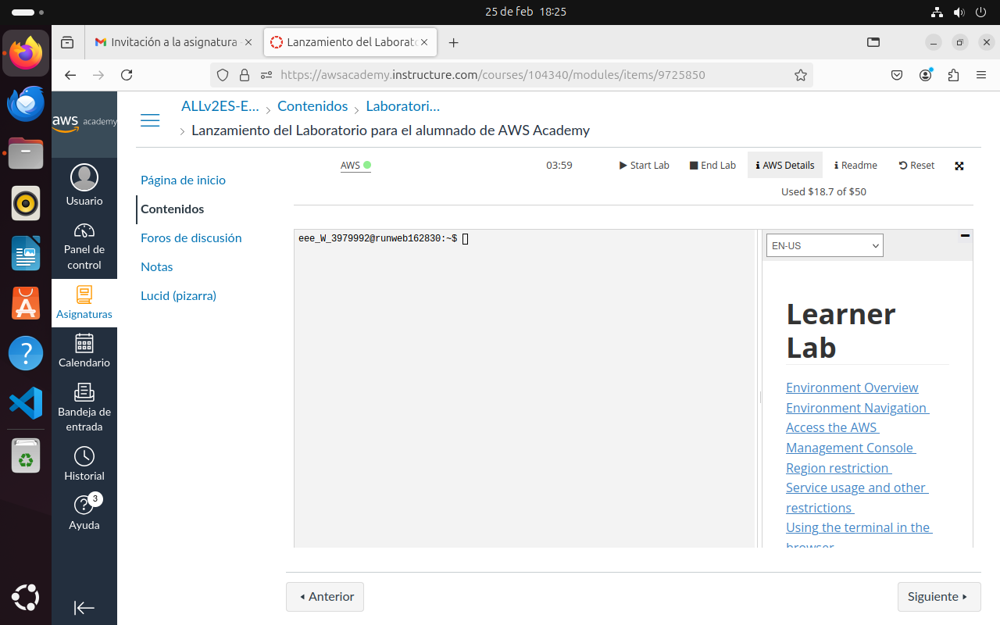
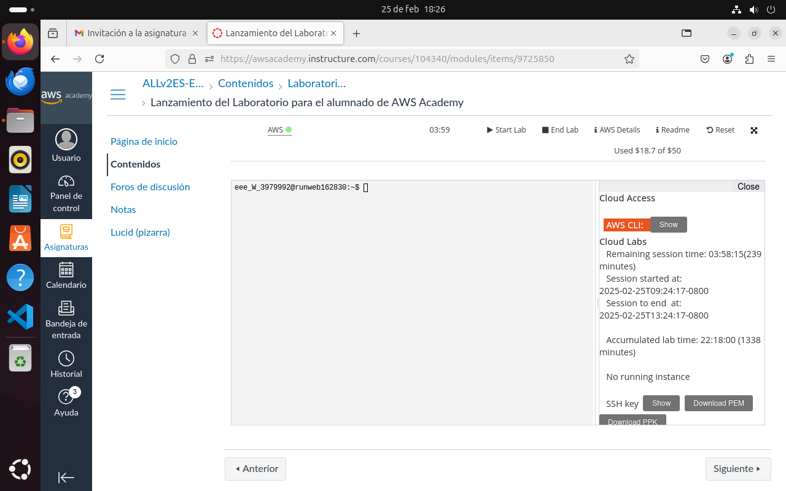
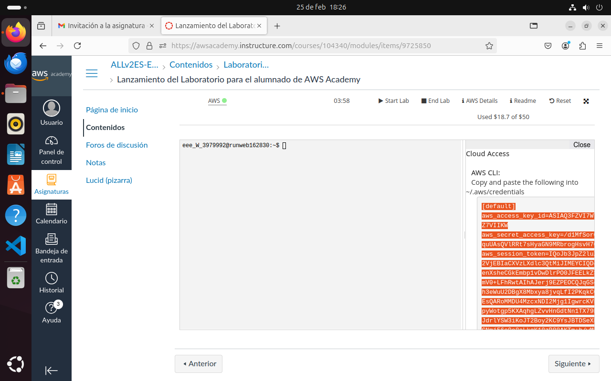

Para encontrar el archivo de las credenciales y escribir en el escribimos
```
nano /home/ubuntu/.aws/credentials
```
- Nos aparecerán las credenciales antiguas, las borramos enteras
- pegamos las credenciales nuevas
- pulsamos ctrl + o para guardar los cambios, enter para confirmar, ctrl x para salir del archivo

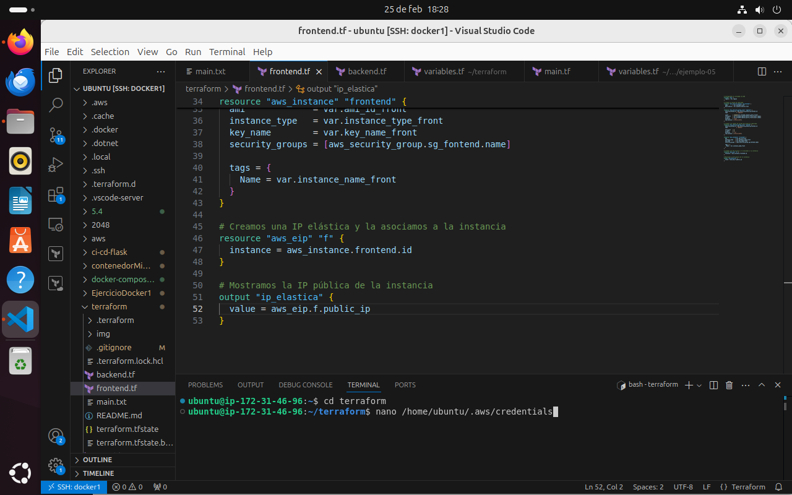
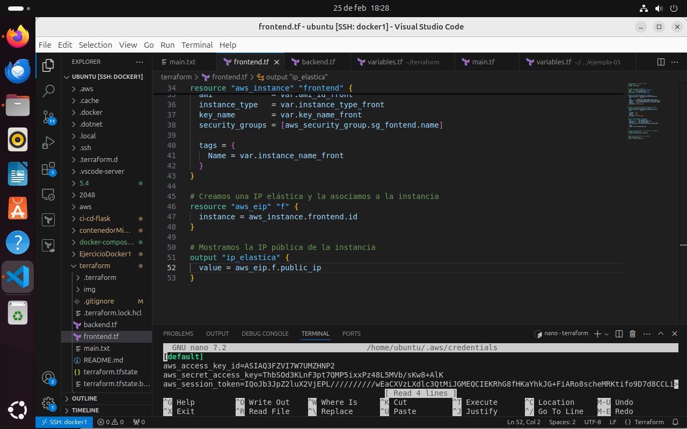
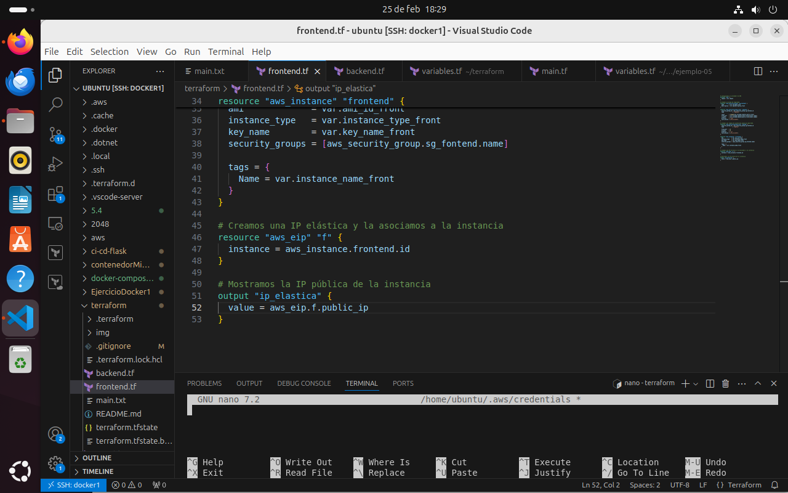
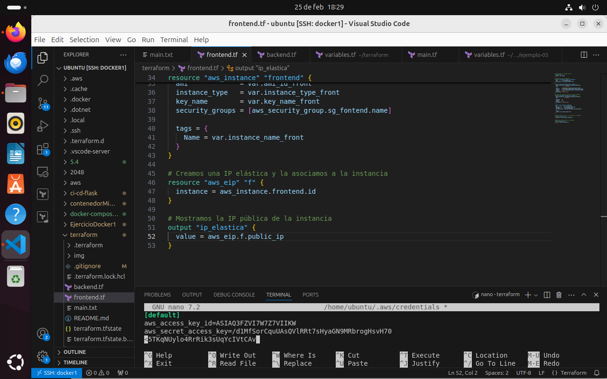

Una vez hecho esto ya podemos usar los comandos de terraform

Para crear las instancias con los comandos de terraform primero instalaremos los pugins de terraform con el comando  
```
terraform init
```
Formatearemos el archivo con el comando  
```
terraform fmt
```
Comprovaremos que la sintaxis de los archivos que hemos creado es valida con  
```
terraform validate
```
Por ultimo aplicaremos los cambios necesarios para crear nuestra instancia, pero antes de aplicar cambios podemos ver que cambios que va a realizar terraform con el comando  
```
terraform plan
```
Para aplicar los cambios de forma automatica (de manera que no tengamos que confirmarlo a mano) usaremos el comando  
```
terraform apply -auto-approve
```
Si queremos confirmarlo manualmente usaremos  
```
terraform apply
```
Por ultimo, tambien podemos destruir el recurso con el comando  
```
terraform destroy
```

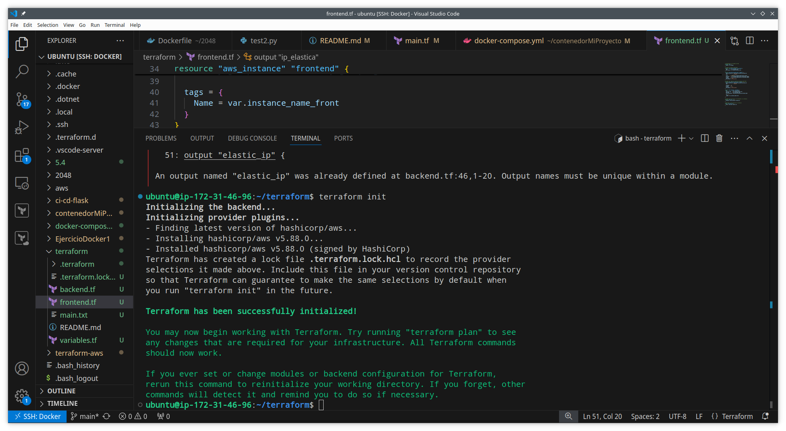
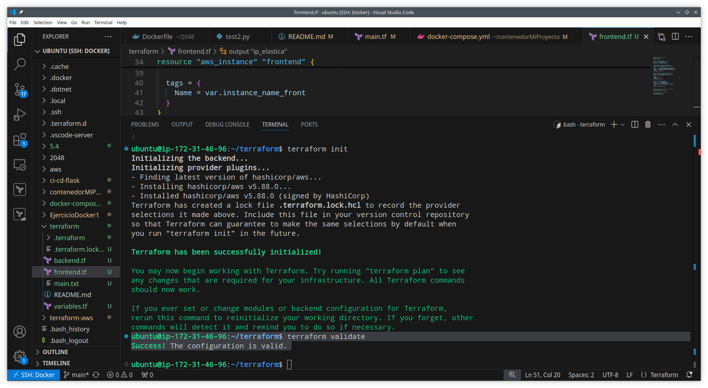
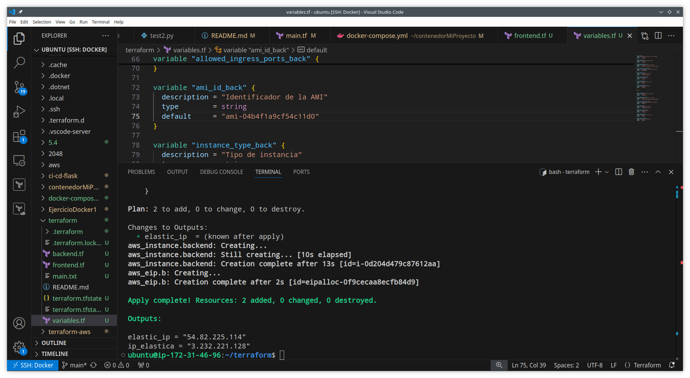

